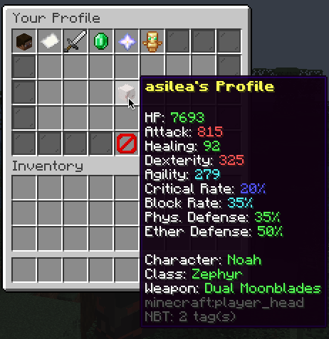

# Xenocraft

A recreation of Xenoblade Chronicles 3 in Minecraft in a weirdly depicted RPG style.

## Introduction

Xenoblade Chronicles 3 is a JRPG game with a ton of characters building sets. In the main game, you can customize the main cast, which you
can control, including **Noah**, **Mio**, **Eunie**, **Taion**, **Lanz** and **Sena**.

Each character has their own sprinkle of specialty and uniquness, but all of them can utilize a number of classes, learned from heroes they
encounter on their journey.

There are **__2 heavy spoilers__** names in these classes, but otherwise these only tell you their names and titles with no backstory
included.

There are also a few heavy spoilers included in names for **some** arts.

You can check very basic information about the concept here, more can be found in the repository's wiki.

## Compatibility

This project is only compatible with Minecraft 1.16 and above. Requires:

- [HikariLibrary](https://github.com/harulol/hikari-library)
- [MultiJVMLang](https://github.com/harulol/multi-jvm-lang)

MultiJVMLang can be substituted with any `jar` files that include the Scala Runtime Library v3 or above.

## Stats

### Profile

There are quite a number of stats in the game:

- HP: Quite generic for RPGs. Your health. You are incapacitated if this reaches 0.
- Attack: Also generic for RPGs. The base value for damage formulas.
- Healing Power: The base value for healing formulas.
- Dexterity: Affects how likely you can land a hit on an enemy.
- Agility: Affects how likely you can dodge enemies' hits.
- Critical Rate: Affects how likely you can deal a critical hit. Critical hits deal typically 25% more damage.
- Block Rate: Affects how likely you can block a hit. If a critical hit is blocked, that hit is no longer considered to be critical and all
  damage gains are dropped.
- Physical Defense: Affects how much damage you can negate from physical attacks.
- Ether Defense: Affects how much damage you can negate from ether attacks.

### Physical vs. Ether Attacks

Physical attacks can deal critical hits but can be blocked.

Ether attacks can never crit but will never be blocked.

Both can be evaded or missed.

## Characters

### Characters

There are 6 characters you can select from in this game. Each of them specialize on their own, based on the OG game's presets:

- Noah: An all-rounder attacker. He excels at nothing but he is also not bad at anything. He has 2 secret talent arts that can be used with
  any class.
- Mio: An agile defender. She specializes in **Agility**. She has 1 secret talent art that can be used with any class.
- Eunie: A pure healer. She specializes in **Healing Power**.
- Taion: The nerd of the group. He specializes in **Dexterity**.
- Lanz: A face tank specializing in **HP**.
- Sena: A small Agnian attacker specializing in **Attack**.

## Classes

### Classes

There are quite a number of hero classes you can select in the game. Each class provides you a special set of **Class Arts**. Each class has
a special role it fulfills in the party:

- Attacker (usually denoted with Red): the one dealing the damage mainly
- Defender (usually denoted with Aqua): the one holding enemies' aggro due to excellent agility and HP.
- Healer (usually denoted with Green): the backbone of the party, propping and applying buffs to everyone.

Classes have their own affiliations based on the nation they come from in the game. Kevesi (from Keves) classes recharge arts by time.
Agnian (from Agnus) classes recharge arts when you land a successful hit.

When you select a character and a class, there are a few special combinations that let you upgrade your own weapon and gain more Attack,
Dexterity, Critical Rate and Block Rate. The combinations are based on their own weapons in the main game. You can upgrade your weapon if:

- You choose **Swordfighter** as **Noah**.
- You choose **Zephyr** as **Mio**.
- You choose **Medic Gunner** as **Eunie**.
- You choose **Tactician** as **Taion**.
- You choose **Heavy Guard** as **Lanz**.
- You choose **Ogre** as **Sena**.

### Weapons

## Arts & Skills

### Arts

When you select a **Class**, you are given a set of **Class Arts** (5), from which you can select 3 to be available in your Arts Palette.

The Arts Palette contains the arts you want to use during battle, these can not be changed if you're currently in one.

Additionally, you can fuse arts together by equipping a **Master Art** on the same art row to further boost both arts' effects. You can
equip any **Master Arts** from the **opposing** nation. A kevesi class can not equip Kevesi master arts, and vice versa. You can select at
maximum 3 master arts.

There's also a special 7th art, dubbed the **Talent Art**. This usually is the art that grants special powerful effects or deal very high
damage. Each class has its own **Talent Art**, but you can use talent arts from any class. A **Zephyr** can always use a Talent Art from *
*Medic Gunner**, for example. Lastly, there are 3 special talent arts accessible only to Noah and Mio.

### Skills

Quite similar to arts, when you select a Class, you are equipping with a number of **Class Skills**. However, these **Class Skills** can not
be changed. They always come with the class. For example, **Split-Second Counter** is a special skill that comes with the **Zephyr** class.

There are 3 slots that you can equip with **Master Skills**. **Master Skills** are special skills that classes have given away to others.
They can be used regardless of nations. You don't need to be in a Kevesi class to utilize Agnian skills. You can use both Kevesi and Agnian
skills.

## Gems

### Gems

Gems are utility items that add some sort of flat stat boost to your character builds. Gems are specialized into 4
categories: `Attack`, `Defend`, `Heal`, and `Special`. True to their categories, the gems there will help.

For example, **Analyze Weakness 10** adds a flat 70% crit damage to you once equipped. This is an `Attack` gem (as denoted with Red and
Redstone).

You can select up to 3 gems, but no duplicates are allowed.

## Accessories

### Under development...
